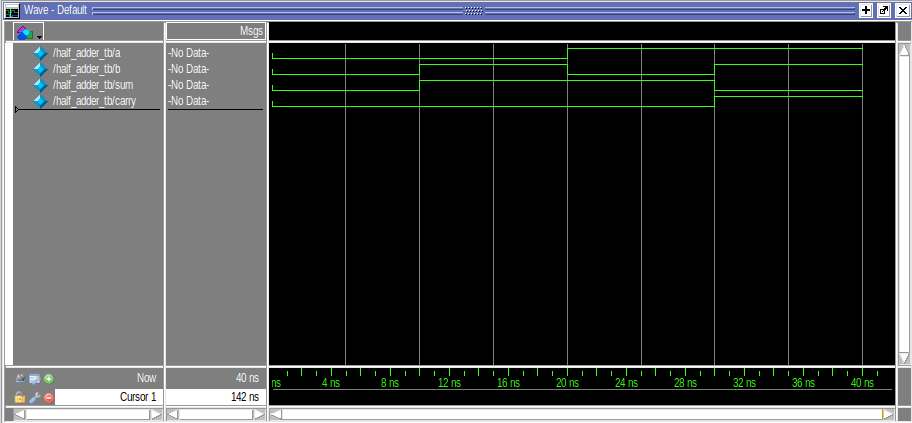
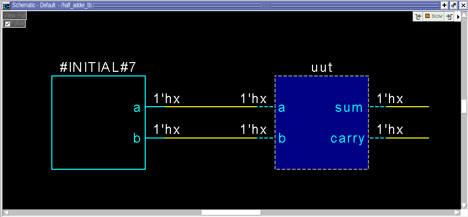
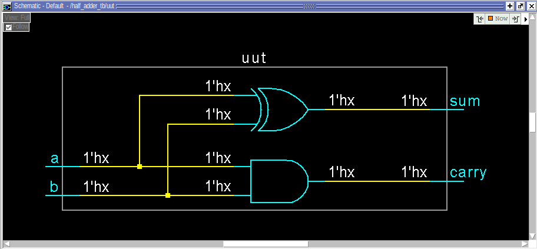
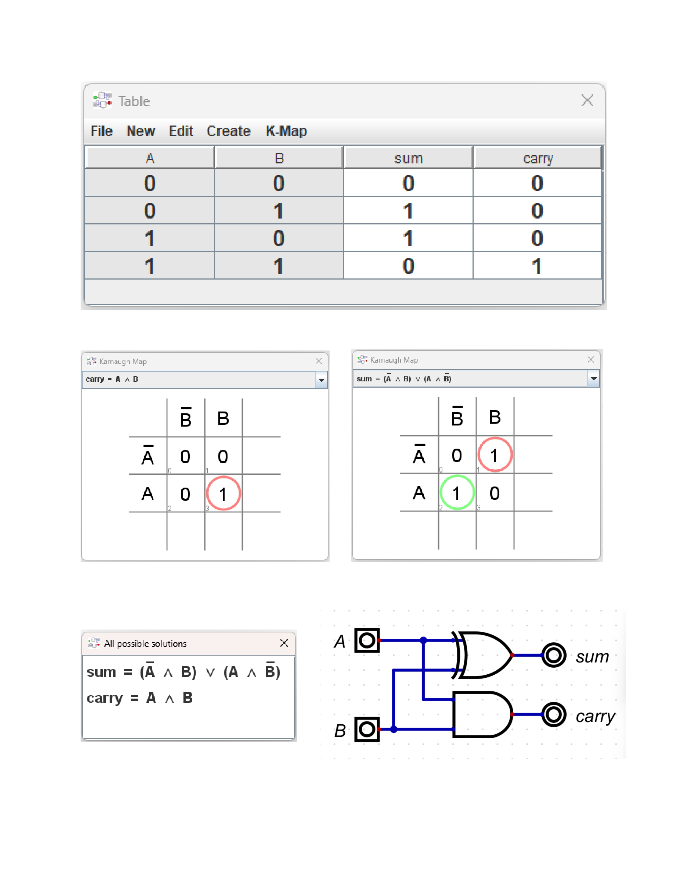

# HalfAdder

A basic Verilog HDL implementation of a half adder digital circuit.

## Table of Contents
- [Introduction](#introduction)
- [Project Structure](#project-structure)
- [Design and Implementation](#design-and-implementation)
- [Simulation](#simulation)
- [Files Overview](#files-overview)
- [How to Use](#how-to-use)
- [Dependencies](#dependencies)
- [License](#license)

## Introduction

This project demonstrates the design and simulation of a half adder using Verilog. The half adder is a fundamental combinational logic circuit that takes two input bits and produces a sum and carry output.

## Project Structure

The project is organized as follows:

- `src/rtl/`: Contains the Verilog code for the basic gates.
    - **`halfAdder.v`**: The Verilog module file where the halfAdder is implemented using the **dataflow model**.
    
- `sim/`: Contains all simulation-related files.
    - `testbench/`: Contains the Verilog testbench code to simulate and verify the halfadder modules.
    - **`halAdder_tb.v`**: The testbench file that applies test vectors to the gates in `halfAdder.v` and verifies their functionality.
    - `result/images/`: Contains the images for the simulation results:
        - **waveform.png**: A screenshot of the waveform generated during the simulation.
        - **schematic.png**: A schematic diagram of the gate-level design.
        - **gatelevelschematic.png**: A gate-level schematic representation of the design.

## Design and Implementation

### Verilog Modules

The basic gates are implemented in the `src/rtl/allgates.v` file using the **dataflow modeling** style of Verilog. Each gate is defined with the corresponding logic equation, making use of Verilog's built-in operators to model the functionality.

- **SUM**: `assign sum = a ^ b;`
- **CARRY**: `assign carry = a & b;`

The dataflow model is used here to make the design simple and concise while ensuring the correct behavior of each gate.

### Testbenches

The testbenches are written in the `sim/testbench` directory and are responsible for simulating the haladder with all possible input combinations to verify correctness.

### Simulation Results

Simulation results are stored in the `sim/result/images/` directory and include:
- **Waveform**: The waveform generated during the simulation that shows the signal transitions halfadder output.
  
- **Schematic**: A general schematic representation of the gate-level design.
  
- **Gate-level Schematic**: A more detailed gate-level schematic showing the logic gates in their implemented form.
  

## Files Overview

Here’s a brief overview of the files in the repository:

### `src/rtl/`
- **`halfAdder.v`**: Verilog module that contains the implementation of halfadder using the dataflow model.

### `sim/`
- **`testbench/`**: Contains the testbench files for simulating the halfadder. For example:
    - **`halfAdder_tb.v`**: Testbench to simulate the gates in `halfAdder.v`.
    
- **`result/images/`**: Contains the images of the simulation results:
    - **`waveform.png`**: A screenshot of the waveform of the simulation.
    - **`schematic.png`**: The schematic diagram of the design.
    - **`gatelevelschematic.png`**: The gate-level schematic of the design.
### `Theory`
- **`halfAdder.jpg`**: Is a image where the truth table Kmap boolean equationan and the circuit is shown for reference.
- 

## How to Use

### Requirements

To run the simulation, you will need **QuestaSim** (or **ModelSim**, which is the same simulator suite):.
- [QuestaSim](https://www.mentor.com/products/fpga/questasim) or [ModelSim](https://www.mentor.com/products/fpga/modelsim)

### Viewing the Simulation Results

You can view the simulation waveform and other images in the `sim/result/images/` directory, such as:
- **`waveform.png`**: View the signal transitions for each gate's output.
- **`schematic.png`**: View the schematic diagram of the gate-level design.
- **`gatelevelschematic.png`**: View the gate-level schematic representation of the design.

## Dependencies

- **QuestaSim** or **ModelSim** (for simulation)
- Text editor for Verilog code (Visual Studio Code, Sublime Text, etc.)

## License

#This project is open-source and available under the [MIT License](LICENSE).
